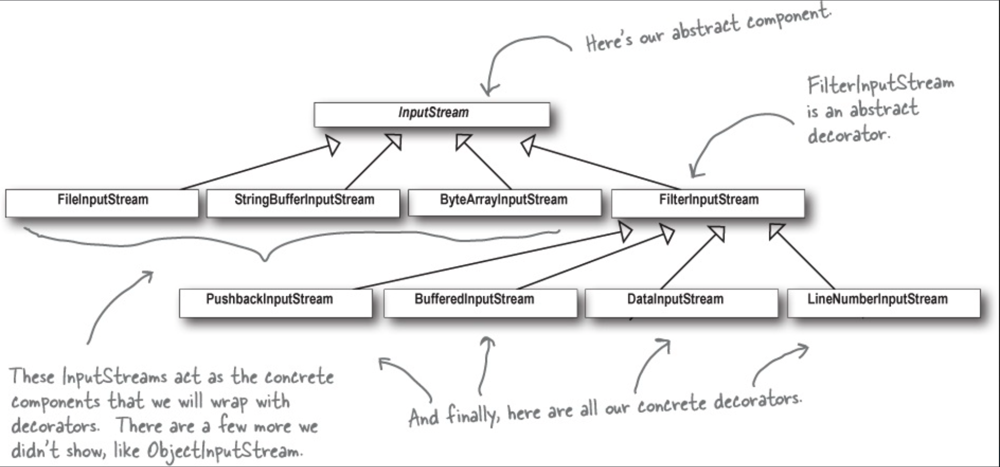

## 1. Code reuse: strategy pattern
**Inheritance** is bad because if you add sth in the superclass, every subclass inherits it will have that method.

And if you choose to add **interface**, then you need to implement those methods in every subclass that needs the methods (as Java interface don't have implementation code -- same for typescript interface).

### Encapsulate what varies
So we need to **seperate** what is *constant* and what is *varing*, so we can changing the least possible codes when adding new things or changing current behaviours. We can also say it as **take the parts that change and encapsulate them**.

So we won't put the changing parts in the superclass, nor adding interfaces that need to be directly implements by the subclasses.

### Favor composition over inheritance
Instead, we create new classes that implement seperately those parts by **satisfying** the interfaces. So the subclasses can *delegate* (代理) those classes, instead of using a concrecte implementation (either in the superclass or the subclass itself). That way we acheived the **polymorphism** at *runtime*.

And with all those classes, we can say we're *composing* them instead of *inheriting* them.

### Program to interfaces, not implementations


Some examples:

```java
// behaviour interface
public interface QuackBehaviour {
  quack();
}

// abstract superclass
public abstract class Duck {
  quackBehaviour: QuackBehaviour;
  //...
  //some common unchanging behaviours
  public void performQuack() {
    quackBehaviour.quack();
  }

  // we can add a setter in the superclass to define the quackBehaviour at runtime
  public void setQuackBehaviour(QuackBehaviour qb) {
    quackBehaviour = qb;
  }
}

// seperated behaviour classes that do the implementation
class Quack implements QuackBehaviour {
  public void quack() {
    System.out.println('quackkkkkkkk!')
  }
}

class SuperQuack implements QuackBehaviour {
  public void quack() {
    System.out.println('super quack! gagaga')
  }
}

// Then the subclass that extends the superclass by defining which quack behaviour it wants
public class RubberDuck extends Duck {
  public RubberDuck() {
    // N.B. here in the constructor we're still making a new instance of a concrete implementation class, but we can dynamically change it at runtime
    quackBehaviour = new Quack();
  }
}

// now when we use the RubberDuck on runtime
public class DuckSimulator {
  public static void main(String[] args) {
    Duck rubber = new RubberDuck();
    rubber.performQuack(); 
    // 'quackkkkkkkk!'
    rubber.setQuackBehaviour(new SuperQuack());
    rubber.performQuack(); 
    // 'super quack! gagaga'
  }
}
```

So, `HAS-A` can be better than `IS-A`. Or rather, favor composition over inheritance.

### Quiz
Later if we want to have a duck call device that doesn't inherits `Duck` class, but only do the quack to mimic the call of duck, how we can do it ?

```java
public interface IDuckCall {
  quackBehaviour: QuackBehavoir;
  setQuack(QuackBehavoir: qb);
  performQuack();
}

public class DuckCall implements IDuckCall {
  quackBehaviour: QuackBehavoir;

  public void setQuack(QuackBehavoir: qb) {
    quackBehaviour = qb;
  }
  public void performQuack() {
    quackBehaviour.quack();
  }
}

public class DuckCallSimulator {
  public static void main(String[] args) {
    DuckCall duckCall = new DuckCall();
    duckCall.setQuackBehaviour(new SuperQuack());
    duckCall.performQuack(); 
    // 'super quack! gagaga'
  }
}
```

### Sumup
We have the first OO pattern here, **Strategy parttern** : that is, defines *a group of algorithms* (behaviours classes like the example above), and make them *interchangeable* (you can replace `Quack` with `SuperQuack` without changing anything else as long as they implement the same interface).

By doing so we achieved the *polymorphism* at runtime, and we compose those algorithms instead of inherit the class that implement them. (N.B. the composition is done by using `setters` in the abstract superclass).

### Perspective FP
**Just use partial application with functions as params and we're done!**

As the main point of Strategy pattern is using *Inversion of control* to have runtime *polymorphism* & flexibility.

```typescript
type FlyBehaviour = () => void;
type SquackBehaviour = () => void;

interface Duck {
    fly: FlyBehaviour,
    squack: SquackBehaviour,
}

const duck = (flyBehaviour: FlyBehaviour) => (squackBehaviour: SquackBehaviour) : Duck => ({
  //...common codes for all ducks
  fly: flyBehaviour,
  squack: squackBehaviour,
});

const rubberDuckFly: FlyBehaviour = () => {
  console.log('rubber fly');
}

const rubberDuckSquack: SquackBehaviour = () => {
  console.log('rubber squack');
}

const superDuckSquack: SquackBehaviour = () => {
  console.log("super duck gagagag!");
}

const flyRubberDuck = duck(rubberDuckFly);

// any rubberDuck variations you want
const regularRubberDuck: Duck = flyRubberDuck(rubberDuckSquack);
regularRubberDuck.fly();
//"rubber fly" 
regularRubberDuck.squack();
// "rubber squack"

const superRubberDuck: Duck = flyRubberDuck(superDuckSquack);
superRubberDuck.fly();
//"rubber fly" 
superRubberDuck.squack();
// "super duck gagagag!"
```

## 2. Loosely coupling: observer pattern
- We have a publisher (Subject)
- and multiple subscribers (Observers)

Everytime there's update on the data, the subject publish a notification, then all the observers who subscirbe to it get notified. And observers can register/unregister anytime they want.

So we have a typical *one-to-many* dependency. That is, one object (Subject) changes state, all of its dependents are notified.

Because the subject don't care about how many objects are subscirbed to its data, it will deliver notifications to any object that implements the Observer interface. That's why we say they are *loosely coupled*.

### Manual version of obersver pattern:

```java
// how we can define a data struct ?
class Data {
  private float temprature;
  private float pressure;
}

public interface Subject {
  addObserver(Observer o);
  removeObserver(Observer o);
  notifyChanges();
}

public interface Observer {
  update(Data data);
}

// the Subject class
public class CenteredData implements Subject {
  // we use an array to keep track of all subscribed observers
  private ArrayList<Observer> observers;
  pirvate Data data

  public CenteredData() {
    observers = new ArrayList<Observer>();
  }
  public void addObserver(Observer o) {
    observers.add(o);
  }
  public void removeObserver(Observer o) {
    int i = observers.indexOf(o);
    if (i >= 0) {
      observers.remove(i)
    }
  }
  public void notifyChanges() {
    // here's the fun part, how we notify the observers
    for (Observer observer : observers) {
      observer.update()
    }
  }
  public void onDataChanges(Data changedData) {
    this.data = changedData;
    notifyChanges();
  }

  // and as we are using pull model, we need to set getter for the observers
  public Data getData() {
    return data;
  }
}

public class ObserverA implements Observer {
  private Data data;
  private Subject centeredData
  public ObserverA(Subject centeredData) {
    // here we keep a reference to the centeredData object, so later we can call the `removeObserver` if needed
    this.centeredData = centeredData;
    centeredData.addObserver(this);
  }
  public void update() {
    // here it's the observer pulling data from observable
    this.data = this.centeredData.getData();
  }
}
```

### Java built-in observer pattern
Java has built-in support of observer pattern, in the `util`, which already handled the add/remove/notify part of it. We can re-implement the above like this:

```java
import java.util.Observable;
import java.util.Observer;

public class CenteredData extends Observable {
  pivate Data data;
  public CenteredData() {}
  public void notifyChanges() {
    // both methods are specified by the Observable superclass
    setChanged();
    // N.B. here if we pass nothing to the notify method, it use automatically the `pull` model, that is, the observers are responsible to pull the data from the subject, instead of the subject pushing data to the observers
    notifyObservers();
  }

  public void onDataChanges(Data changedData) {
    this.data = changedData;
    notifyChanges();
  }

  // and as we are using pull model, we need to set getter for the observers
  public Data getData() {
    return data;
  }
}

public class ObserverA implements Observer {
  Observable observable;
  private Data data;

  public ObserverA(Observable observable) {
    this.observable = observable;
    observable.addOberserver(this);
  }

  public void update(Observable obs, Object arg) {
    if (obs instanceof CenteredData) {
      // type casting in Java, as CenteredData is a subclass of Observable, it's called "explicit upcasting".
      CenteredData centeredData = (CenteredData)obs;
      this.data = centeredData.getData();
    }
  }
}
```

N.B. the order of notifications is not the same as the order in our code. The `notifyObservers()` method implements the order differently, and we can do nothing to change that: the built-in `Observable` class is a class not an interface:
- you need to *subclass* it to use, and it doesn't have an interface you can implements, so you're stuck with the current implementation of this superclass.
- it has a protected method `setChanged()`, so you cannot "compose" it but only "inherit" it.

In short, the built-in oberservable violates lots of OOP principles and are very limited. 😂

### Another example of observer pattern in Java world
- `AbstractButton` superclass in Swing is a `observable`, it has lots of methods to add/remove listeners (AKA `observers`). And an `ActionListener` can *listen in* on any types of actions on a button.

### Sumup
When using **Observer pattern** as a way of achieving loose coupling, generally it's considered more "correct" to use the **pull mode** instead of **push mode**.

### Perspective FP
**Check the reactive programming, or just the orginal callbacks**

As the main point of Observer pattern is all about loose coupling & message passing.

## 3. Runtime behaviour that transparent to the client: decorator pattern
### Open-closed principle
Classes are **closed** to modification, but **open** to extention (so here's where the decorator pattern comes in: you can add new behaviour or changes without altering the classes, but adding your own extention).

If you think about the observer pattern, by adding a new observer, we're actually extending the functionality of a subject (observable) without any changes in the subject itself.

As the decorator need to have the same **supertype** as object it decorates, wth an **existing** abstract superclass, we still need to subclass THAT superclass, in order to get the *type matching*, here the inheritance is not for *getting behaviour* but just for type.

In theory if we don't already have an abstract class in place, we could use an `interface` just fine.

> SideNote: that's where OOP sucks, type is type, and class is not type.


```java
public abstract class Beverage {
  public enum Size { TALL, GRANDE, VENTI };
  Size size = Size.TALL;

  String description = "Unknown Beverage";

  public String getDescription() {
    return description;
  }

  public void setSize(Size size) {
    this.size = size;
  }

  public void getSize() {
    return this.size;
  }

  public abstract double cost();
}

// the comdiment abstract decorator
public abstract class CondimentDecorator extends Beverage {
  public Beverage beverage;

  public abstract String getDescription();

  public Size getSize() {
    return beverage.getSize();
  };
}

// concrete beverage class
public class DarkRoast extends Beverage {
  public DarkRoast() {
    description = "Dark Roast";
  }

  public double cost() {
    if (this.getSize() == Size.TALL) {
      return 10.00;
    } else if (this.getSize() == Size.GRANDE) {
      return 11.00;
    } else if (this.getSize() == Size.VENTI) {
      return 12.00;
    }
  }
}

// concrete condiment class
public class Mocha extends CondimentDecorator {
  public Mocha(Beverage beverage) {
    this.beverage = beverage;
  }

  public String getDescription() {
    return beverage.getDescription() + ", Mocha";
  }

  public double cost() {
    double cost = beverage.cost();
    if (beverage.getSize() == Size.TALL) {
      return cost + .20;
    } else if (beverage.getSize() == Size.GRANDE) {
      return cost + .30;
    } else if (beverage.getSize() == Size.VENTI) {
      return cost + .40;
    }
    return cost;
  }
}

public class Milk extends CondimentDecorator {
  public Milk(Beverage beverage) {
    this.beverage = beverage;
  }

  public String getDescription() {
    return beverage.getDescription() + ", Milk";
  }

  public double cost() {
    double cost = beverage.cost();
    if (beverage.getSize() == Size.TALL) {
      return cost + .30;
    } else if (beverage.getSize() == Size.GRANDE) {
      return cost + .40;
    } else if (beverage.getSize() == Size.VENTI) {
      return cost + .50;
    }
    return cost;
  }
}

// now the runtime usage
public class SomeCoffee {
  public static void main(String args[]) {
    Beverage beverage = new DarkRoast();
    beverage.setSize(Size.VENTI);
    System.out.println(beverage.getDescription() + " $" + beverage.cost());

    // my eyes... 🙄
    beverage = new Mocha(beverage);
    beverage = new Mocha(beverage);
    beverage = new Milk(beverage);

    System.out.println(beverage.getDescription() + " $" + beverage.cost());
  }
}
```

### Real world usage in Java
Java I/O package

`java.io` classes use heavily the decorator pattern.



We can rollup our own version of the input decorator.

```java
// convert all uppercase characters to lowercase

// FilterInputStream is the abstract class for all decorators
public class LowerCaseInputStream extends FilterInputStream {
  public LowerCaseInputStream(InputStream in) {
    super(in);
  }

  // to read a byte
  public int read() throws IOException {
    int c = in.read();
    return (c == -1 ? c : Character.toLowerCase((char)c)); // (char) here is an explict type casting
  }

  // to read an array of bytes
  public int read(byte[] b, int offset, int len) throws IOException {
    int result = in.read(b, offset, len);
    // so the in.read here returns index ???
    for (int i = offset; i < offset+result; i++) {
      b[i] = (byte)Character.toLowerCase((char)b[i]);
    }
    return result;
  }
}
```

### Some drawbacks of decorator pattern
- A lot of fraction classes make the whole system less intuitive (like the Java I/O libraries).
- Some typing issues by inserting decorators, if some code is dependent on specific types.

### Sumup
- Decorators are **extentions** to existing classes without modification or subclassing
- Basically it's a set of decorator classes used to **wrap** concrete component classes
- the decorator need to be the **same type** as the class they decorated, so it's transparent to usage, and we can add as many decorators as we want.
### Perspective FP
Is this just higher order function with partial application again ? All we need is a **common interface** that all HOCs (AKA decorators) should satisfy.

```typescript
enum CoffeeType {
    Dark = 'dark'
}

enum CondimentType {
    Mocha = 'mocha',
    Milk = 'milk',
}

enum Size {
  Tall = 'small',
  Grande = 'medium',
  Venti = 'large',
}

type sizeVaries = Record<Size, number>

interface coffeeConf {
    cost: sizeVaries,
    description: string,
}

interface condimentConf {
    cost: sizeVaries,
    name: string,
}

const COFFEES: Record<CoffeeType, coffeeConf> = {
    [CoffeeType.Dark]: {
        cost: {
            [Size.Tall]: 10,
            [Size.Grande]: 12,
            [Size.Venti]: 14,
        },
        description: 'best dark coffee in town'
    }
}

const CONDIMENTS: Record<CondimentType, condimentConf> = {
    [CondimentType.Mocha]: {
        cost: {
            [Size.Tall]: 3,
            [Size.Grande]: 4,
            [Size.Venti]: 5,
        },
        name: 'mocha'
    },
    [CondimentType.Milk]: {
        cost: {
            [Size.Tall]: 4,
            [Size.Grande]: 5,
            [Size.Venti]: 6,
        },
        name: 'milk'
    },
}

// here's the common interface (or type)
type Beverage = {
    hasCondiment: boolean,
    description: string,
    cost: number,
    name?: string,
    size: Size,
}

// utility 
const coffeeMaker: (coffeeType: CoffeeType) => (size?: Size) => Beverage = (coffeeType: CoffeeType) => (size = Size.Tall) => {
  const {cost, description} = COFFEES[coffeeType];
  return {
    description,
    hasCondiment: false,
    cost: cost[size],
    size,
  }
}

const addCondiment = (condimentType: CondimentType) => (quantities: number = 1, discount: number = 1) => (beverage: Beverage) => {
  const {cost, name} = CONDIMENTS[condimentType];
  const total = beverage.cost + (cost[beverage.size] * quantities * discount);
  return {
      ...beverage,
      hasCondiment: true,
      description: beverage.hasCondiment ? `${beverage.description} & ${name}` : `${beverage.description} with ${name}`,
      cost: total
  };
}

// application codes
const addMocha = addCondiment(CondimentType.Mocha);
const addMilk = addCondiment(CondimentType.Milk);

const darkRoast = coffeeMaker(CoffeeType.Dark);
const smallDarkRoast = darkRoast(Size.Tall);
const mediumDarkRoast = darkRoast(Size.Grande);
const bigDarkRoast = darkRoast(Size.Venti);


// runtime
const order1 = addMilk()(addMocha(2)(smallDarkRoast)); // yea you can just add 2 mocha
console.log(order1.cost); // 20
console.log(order1.description) // "best dark coffee in town with mocha & milk" 

const order2 = addMilk(1)(smallDarkRoast);
console.log(order2.cost); // 14
console.log(order2.description) // "best dark coffee in town with milk" 

// here the price will change according to the size we choose, automatically for the condiments
const bigOrder1 = addMilk()(addMocha(2)(bigDarkRoast));
console.log(bigOrder1.cost); // 30
console.log(bigOrder1.description) // "best dark coffee in town with mocha & milk" 


// later if we want to add a name to the coffee
const addNameForCoffee = (name: string) => (beverage: Beverage) => {
    return {
        name,
        ...beverage
    }
}

// you can add anything you want as long as the returning one satisfied the `Beverage` interface (or rather, type).

// In OOP, it's called "decorator has the same supertype as the object it decorates", so we can swap the decorated object in place of the original object.

const smallDarkRoastWithName = addNameForCoffee('darkRoast!')(smallDarkRoast);

const order3 = addMilk()(addMocha(2)(smallDarkRoastWithName));
console.log(order3.cost); // 20
console.log(order3.description) // "best dark coffee in town with mocha & milk" 
console.log(order3.name); // "darkRoast!"

// and if we want to apply some discount
const withDiscount = (discount: number) => (beverage: Beverage) => {
    return {
        ...beverage,
        cost: beverage.cost * discount
    }
}

const smallDarkRoastWithNameAndDiscount = withDiscount(0.8)(smallDarkRoastWithName);
// so we apply different discount for different tops & coffees
const order4 = addMilk(1, 0.6)(addMocha(2, 0.7)(smallDarkRoastWithNameAndDiscount));
console.log(order4.cost); // 14.6
console.log(order4.description) // "best dark coffee in town with mocha & milk" 
console.log(order4.name); // "darkRoast!"

const bigDarkRoastWithName = addNameForCoffee('big darkRoast!')(bigDarkRoast);
const order5 = addMilk(1, 0.6)(addMocha(2, 0.7)(bigDarkRoastWithName));
console.log(order5.cost); // 24.6
console.log(order5.description) // "best dark coffee in town with mocha & milk" 
console.log(order5.name); // "big darkRoast!"
```


